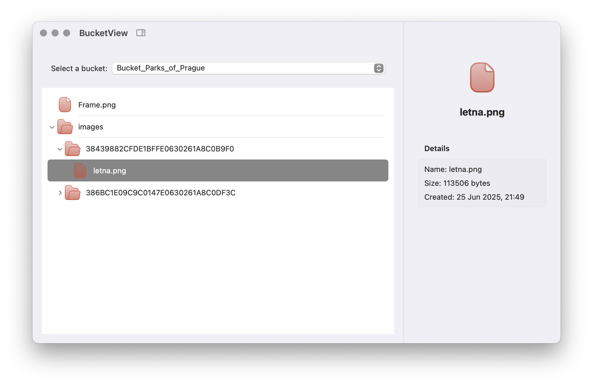
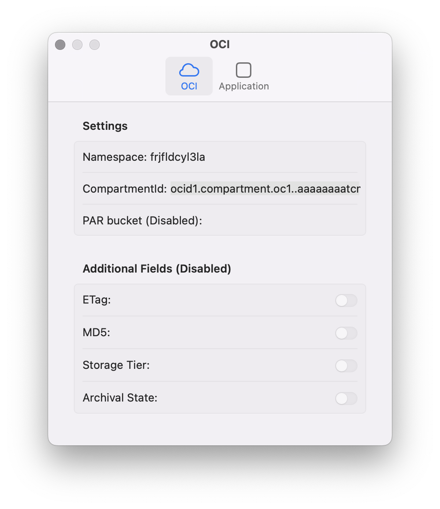

<p align="center">
  
</p>

# BucketView

**BucketView** is a lightweight macOS client for browsing bucket and objets in [Oracle Cloud Infrastructure (OCI)](https://www.oracle.com/europe/cloud/) Object Storage. Designed with clarity and elegance in mind, it provides a file inspector to view your cloud-stored content.

<p align="center">
  
  
</p>

---

## Setup Instructions

### Step 1: OCI Configuration
Ensure you have a valid OCI `config` file located at:


```
~/.oci/config
```


This file must include your API key and profile information. You can generate it using the [OCI CLI](https://docs.oracle.com/en-us/iaas/Content/API/SDKDocs/cliinstall.htm).

### Step 2: Launch and Configure
Start the BucketView application and navigate to **Settings...**. Enter your `compartmentId` to fetch the list of available buckets. Select a bucket to begin browsing files.

---

## Demonstrated OCI Functions

- `getNamespace` — Retrieves your Object Storage namespace.
- `listBuckets` — Lists buckets within the specified compartment.
- `listObjects` — Displays files stored in the selected bucket.

---

## TODO

- [ ] Error handling and user feedback
- [ ] Preauthenticated bucket support
- [ ] Handling additional `fields` support

---
